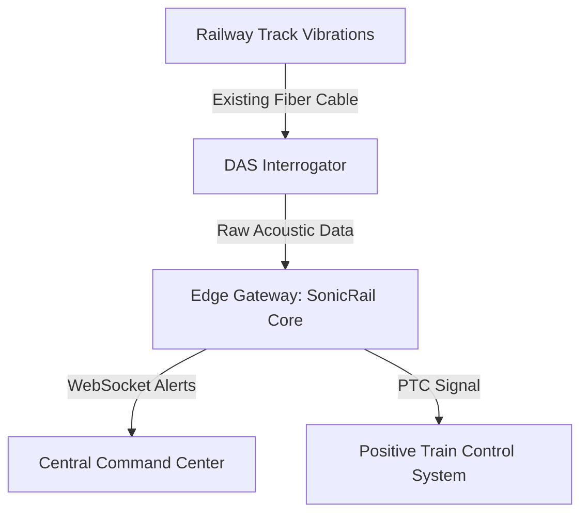

# 🚆 SonicRail: AI-Powered Acoustic Intelligence for Railway Safety

[](https://www.python.org/downloads/)
[](https://reactjs.org/)
[](https://opensource.org/licenses/MIT)
[](https://en.wikipedia.org/wiki/Distributed_acoustic_sensing)

SonicRail is a next-generation **National Track Safety Intelligence System** that transforms existing railway telecom fiber optic infrastructure into a high-precision Distributed Acoustic Sensing (DAS) network. By leveraging edge AI and deep learning, SonicRail detects, classifies, and alerts operators to rail hazards—such as rockfalls, track fractures, and animal intrusions—in under 2 seconds.


---

## 🌟 Core Value Proposition

Railway networks span thousands of kilometers, making physical monitoring impossible. SonicRail solves this by:
- **Zero New Sensors**: Uses existing fiber optic cables alongside tracks as virtual microphones.
- **Sub-Second Latency**: Edge-optimized inference for immediate hazard response.
- **Explainable AI**: Provides spectral analysis and FFT visualization for every detection.
- **Predictive Maintenance**: Tracks cumulative vibration stress to predict failures before they happen.

---

## 🛠️ Tech Stack & Architecture

### The Hardware Layer
SonicRail interfaces with DAS Interrogators to monitor track vibrations over 50km+ segments per device.


### The AI Pipeline
The system uses a multi-layered approach to ensure high precision and low false-alarm rates.

1.  **Anomaly Detection Tier**: An **Isolation Forest** model evaluates if the signal is "Normal" (Ambient/Train) or "Out-of-Distribution" (OOD).
2.  **Classification Tier**: A hybrid **CNN-BiLSTM** (CRNN) processes Mel Spectrograms to distinguish between 5 distinct classes:
    -   `train_movement` 🚆
    -   `rockfall_landslide` 🪨
    -   `track_fracture` ⚡
    -   `animal_intrusion` 🐾
    -   `normal_ambient` 🌬️
3.  **Context Intelligence**: Filters alerts based on scheduled maintenance or known weather patterns (e.g., suppressing wind noise during storms).

---

## 🚀 Key Features

-   **Command Center**: Real-time telemetry dashboard with multi-band frequency analyzers.
-   **GeoRail Mapping**: Interactive visualization of track blocks and station health.
-   **AI Incident Manager**: Review historical alerts, playback acoustic "black box" recordings, and generate LLM-powered incident reports.
-   **Simulation Suite**: Test the pipeline with pre-defined scenarios like "Cascade Rockfall" or "Rail Joint Fracture".
-   **Generative AI Assistant**: On-demand analytical chat for operator decision support.

---

## ⚙️ Installation & Setup

### Prerequisites
- **Python**: 3.8 or higher
- **Node.js**: 18.0 or higher
- **FFmpeg**: Required for audio processing

### 1. Clone & Environment
```bash
git clone https://github.com/Varun072006/SonicRail.git
cd SonicRail
python -m venv venv
# Windows
venv\Scripts\activate
# Linux/Mac
source venv/bin/activate
pip install -r requirements.txt
```

### 2. The One-Command Pipeline
Before running the dashboard, you must synthesize the DAS dataset and train the local models:
```bash
python run_pipeline.py
```
*This script automates: `Data Synthesis` → `Feature Extraction` → `Model Training` → `Verification`.*

### 3. Launch the Dashboard
Open two terminals:

**Terminal A (Backend API)**
```bash
python api_server.py
```

**Terminal B (Frontend UI)**
```bash
cd frontend
npm install
npm run dev
```

---

## 🚦 Demonstrating the System

To see SonicRail in action without real track data:
1.  Navigate to `http://localhost:5173`.
2.  Go to the **Administration** sidebar.
3.  Trigger a **Cascade Rockfall** simulation.
4.  Open the **Command Center** to view the live FFT spike and hear the emergency audio siren.
5.  Check the **Incident Manager** to generate an AI report on the event.

---

## 📁 Project Structure

```text
SonicRail/
├── api_server.py            # Flask + SocketIO Gateway
├── decision_engine.py       # Context Awareness & Risk protocols
├── prediction_engine.py     # Live inference bridge
├── anomaly_detector.py      # Isolation Forest implementation
├── frontend/                # React Vite Application
├── data/                    # Synthetic DAS signal storage
└── models/                  # Serialized ML artifacts (.pkl)
```

---

## 🤝 Contributing & License

This system is a prototype designed to showcase advanced signal processing and AI integration in infrastructure. We welcome academic and industrial contributions.

**License**: Distributed under the [MIT License](LICENSE).
